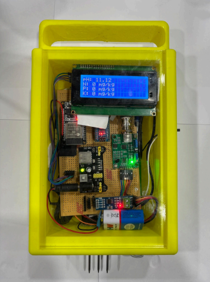
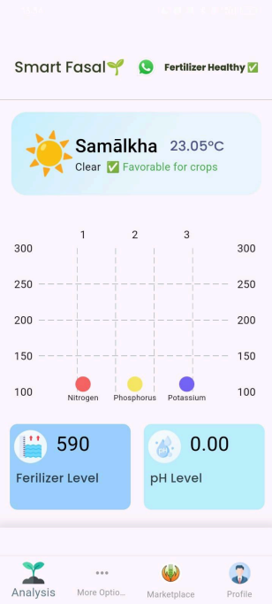
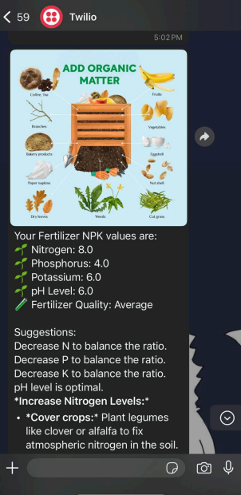
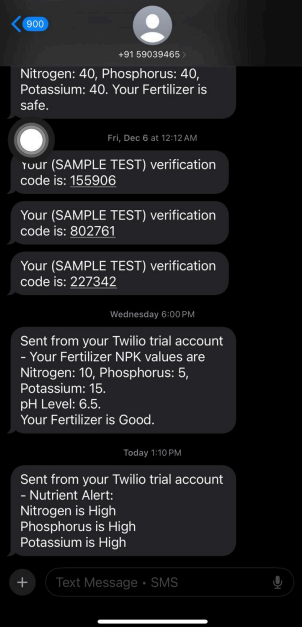
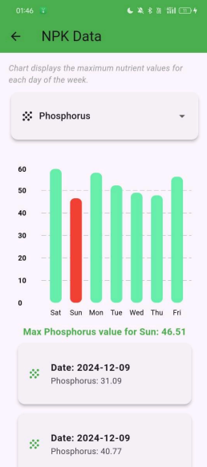

# Smart Fasal 

## Screenshots to understand the workflow

**Smart Fasal** is an innovative mobile application designed to empower farmers by providing real-time nutrient values (NPK) and pH levels of fertilizers. This information helps farmers optimize fertilizer usage, ensuring healthier crop growth while minimizing waste.

---

### NPK Sensor 

### Welcome Screen

### language Screen

### Phone Login

### OTP Screen

### Home Screen

### Fertilizer recommendation Screen

### Chatbot Screen

### Alerts for Farmers

Most farmers use Urea fertilizer on their farms, which contains a high amount of Nitrogen (N). Sometimes, the Nitrogen amount exceeds the required level, negatively affecting crop yield. 

In such scenarios, our mobile application takes the farmer's location and, based on the location's threshold values, sends an alert message to the farmers. Apart from that, farmers can receive daily updates, personalized suggestions (based on their NPK values), and improvement tips via WhatsApp, along with a visual image to enhance their user experience.

---

### whatsapp_alert Screen

### sms_alert Screen

### NPK Weekly data Screen

