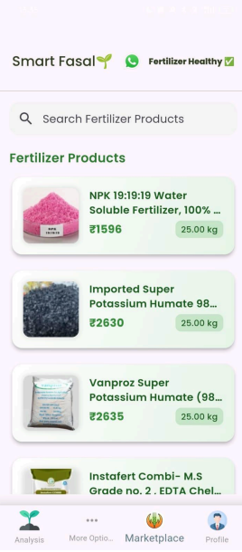

# Smart Fasal 

## Screenshots to understand the workflow

### Smart Fasal is an innovative mobile application designed to empower
###farmers by providing real-time nutrient values (NPK) and pH levels of
###fertilizers. This information helps farmers optimize fertilizer usage,
###ensuring healthier crop growth while minimizing waste

###NPK Sensor 

### Welcome Screen

### language Screen

### Phone Login

### OTP Screen

### Home Screen

### Fertilizer recommendation Screen

### Chatbot Screen

### whatsapp_alert Screen

### sms_alert Screen

### NPK Weekly data Screen

